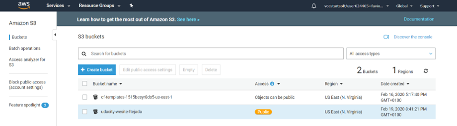
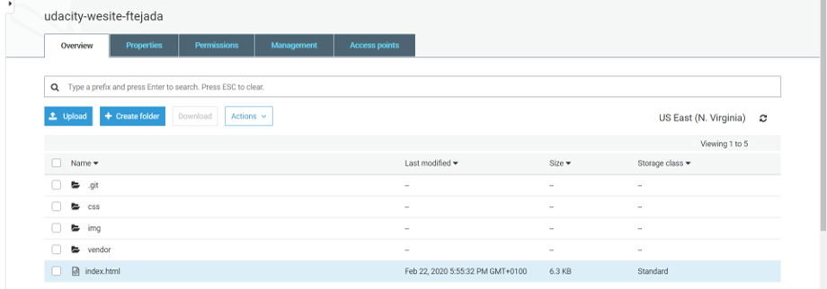
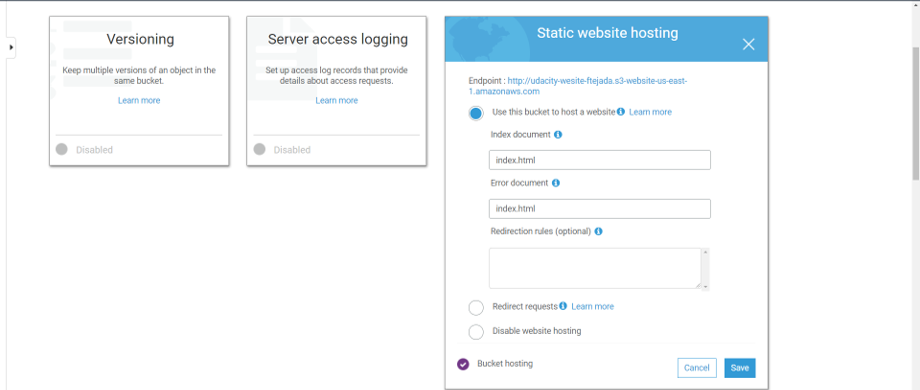
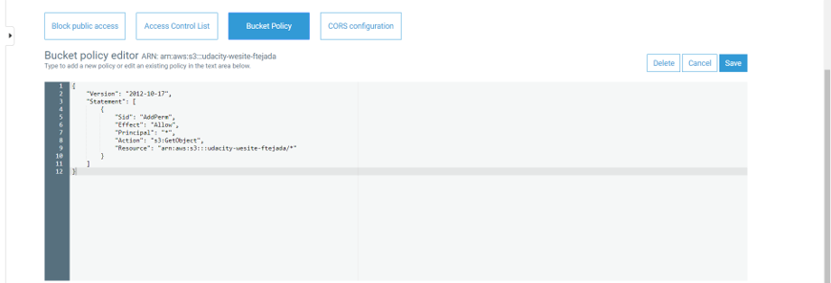
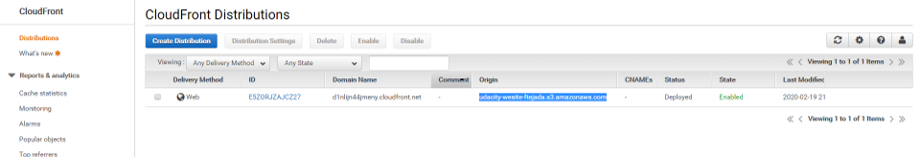

## My first AWS static website

This project is a simple HTML template to exploit AWS *S3* integration with *IAM* and *CloudFront* to deploy static website.

This is the CloudFront endpoint URL to my website:
http://udacity-wesite-ftejada.s3.amazonaws.com/index.html

Below are the steps I followed to achieved so:

1. Created a bucket on S3:

2. Added the resources to it:

3. Enabled static website hosting:

4. Set up IAM policies to make it accessible everywhere:

5. Configured CloudFront distribution:

6. And Voila! My website is up and running:
