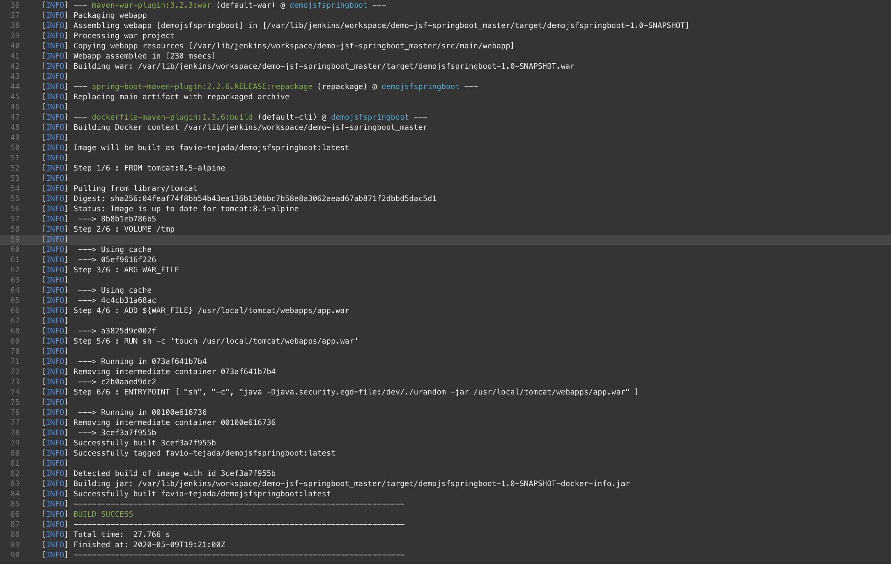

# Capstone

This project is part of Udacity's Cloud Devops Engineer Nanodegree final project. It's goal is to set up a Jenkins environment to deploy a containerized Maven-SpringBoot-Jsf-Java web application into EKS, based on a green/blue deployment strategy.

The Jenkins server is allocated in an AWS EC2 instance, it launches the configured steps to acomplish the above described goal every time a pull-request is merged into master branch.

## Application

As I am a Java Developer, I found motivation to integrate a relatively deprecated (but really nice) frontend Java framework called Primefaces along with the popular SpringBoot into a docker container to be deployed across different infrastructures. The solution consists in a flight booking application, whose code source can be found [here](https://github.com/tejada7/demo-jsf-springboot).<br/>


###
___

## Scope
This project is intended to demonstrate the AWS Jenkins configuration skills adquired throughout the 4-month Nanodegree program. Be able to set up an AWS-EC2 instance, install Jenkins, configure jobs, and automatize to deploy it to EKS.


## The pipeline

Jenkins has been configured to execute the following phases:
* **Linting pom file**: As Maven is one of the most used build automation tools in Java world, I found useful to comply with the naming and structuring conventions by using a [Maven POM lint plugin](https://github.com/lewisd32/lint-maven-plugin) that essentialy verifies that the defined [`pom file`](https://github.com/tejada7/demo-jsf-springboot/blob/master/pom.xml) is correctly written. e.g.
```xml
<results status="FAIL" violations="1">
  <violation rule="GAVOrder">
    <message>Found &apos;artifactId&apos; but was expecting &apos;groupId&apos;</message>
    <description>Maven convention is that the groupId, artifactId, and version elements be listed in that order.  Other elements with short, simple content, such as type, scope, classifier, etc, should be before elements with longer content, such as configuration, executions, and exclusions, otherwise they can be easily missed, leading to confusion</description>
    <location file="demo-jsf-springboot/pom.xml" line="5" column="15"/>
  </violation>
</results>
```

___
* **Linting Java codesource**: Once I ensured the correctness of my POM file, I'm ready to proceed on analysing my Java code, for that I used the [Apache Maven Checkstyle Plugin](https://maven.apache.org/plugins/maven-checkstyle-plugin/).

* **Running tests**: To ensure software's quality, it is adviced to integrate testing, hence the application contains a few for demonstration purposes.

* **Packaging and building docker image**: Once the application is compliant in terms of pom file, sourcecode and all [tests](https://github.com/tejada7/demo-jsf-springboot/blob/master/src/test/java/com/example/demojsfspringboot/controller/FlightControllerTest.java) passing, it's time to create a build image based on a [`tomcat 8 alpine servlet container`](https://hub.docker.com/_/tomcat) that can be run on any machine having Java 8 or onwards installed.


To summarize, the below image ilustrates the steps defined in the [Jenkinsfile](https://github.com/tejada7/demo-jsf-springboot/blob/master/Jenkinsfile):


