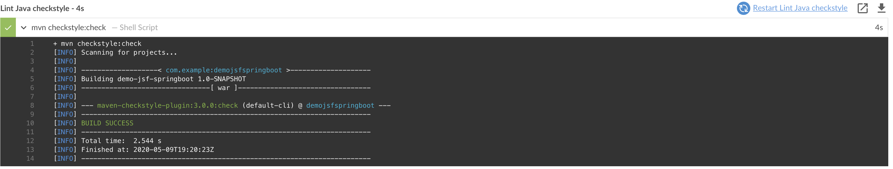
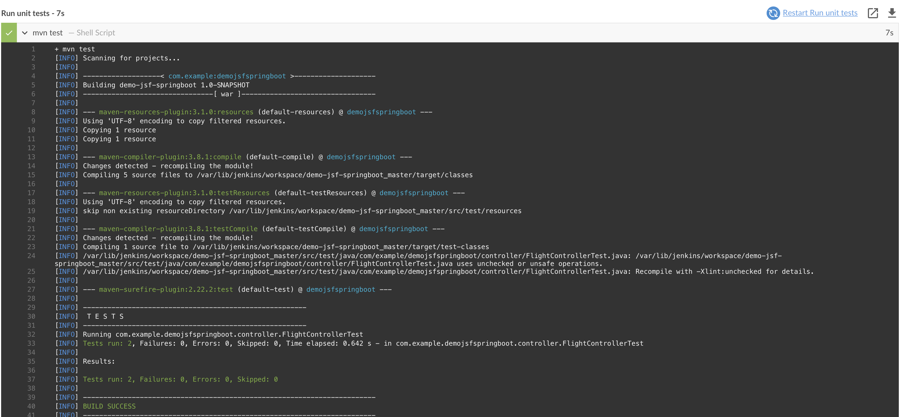
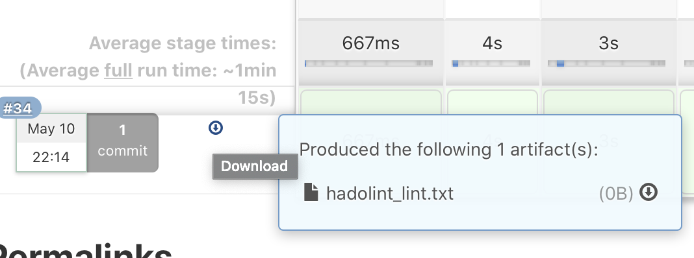

# Capstone

This project is part of Udacity's Cloud Devops Engineer Nanodegree final project. It's goal is to set up a Jenkins environment to deploy a containerized Maven-SpringBoot-Jsf-Java web application into EKS, based on a green/blue deployment strategy.

The Jenkins server is allocated in an AWS EC2 instance, it launches the configured steps to acomplish the above described goal every time a pull-request is merged into master branch.
___
## Pre-requisites
* Posses an AWS account
* Spin up a Jenkins server using a AWS EC2 instance.
* Set up a AWS EKS Cluster by either importing the [cloud formation file](cluster.yml) or executing the following command:
```
eksctl create cluster \
    --name capstone-cluster \
    --region us-west-2 \
    --nodegroup-name standard-workers \
    --node-type t2.micro \
    --nodes 2 \
    --nodes-min 1 \
    --nodes-max 3 \
    --managed
```

### Jenkins plugins
* AWS pipeline
* AWS credentials
* Blue Ocean

### Tools installed in VM
* Docker
* Hadolint
* Java 8
* Maven
* AWS CLI
* eksctl

### Aditional steps
* Add Docker account
* Add AWS creadentials with `aws configure`
___
## Application

As I am a Java Developer, I found motivation to integrate a relatively deprecated (but really nice) frontend Java framework called Primefaces along with the popular SpringBoot into a docker container to be deployed across different infrastructures. The solution consists in a flight booking application, whose code source can be found [here](https://github.com/tejada7/demo-jsf-springboot).<br/>
>>
___
## Scope
This project is intended to demonstrate the AWS Jenkins configuration skills adquired throughout the 4-month Nanodegree program. Be able to set up an AWS-EC2 instance, install Jenkins, configure jobs, and automatize to deploy it to EKS.

___
## The Jenkins CI|CD pipeline

Jenkins has been configured to execute the following phases:
1. **Linting pom file**: As Maven is one of the most used build automation tools in Java world, I found useful to comply with the naming and structuring conventions by using a [Maven POM lint plugin](https://github.com/lewisd32/lint-maven-plugin) that essentialy verifies that the defined [`pom file`](https://github.com/tejada7/demo-jsf-springboot/blob/master/pom.xml) is correctly written. e.g.
```xml
<results status="FAIL" violations="1">
  <violation rule="GAVOrder">
    <message>Found &apos;artifactId&apos; but was expecting &apos;groupId&apos;</message>
    <description>Maven convention is that the groupId, artifactId, and version elements be listed in that order.  Other elements with short, simple content, such as type, scope, classifier, etc, should be before elements with longer content, such as configuration, executions, and exclusions, otherwise they can be easily missed, leading to confusion</description>
    <location file="demo-jsf-springboot/pom.xml" line="5" column="15"/>
  </violation>
</results>
```
>>
2. **Linting Java codesource**: Once I ensured the correctness of my POM file, I'm ready to proceed on analysing my Java code, for that I used the [Apache Maven Checkstyle Plugin](https://maven.apache.org/plugins/maven-checkstyle-plugin/).
>>
3. **Running tests**: To ensure software's quality, it is adviced to integrate testing, hence the application contains a few for demonstration purposes.
>>
4. **Linting Dockerfile**: Verifies that the Dockerfile complies with the [general guidelines and recomendations](https://docs.docker.com/develop/develop-images/dockerfile_best-practices/). I used [hadolint](https://github.com/hadolint/hadolint) tool. 
>>
All output of the static analysis is stored in teh file `hadolint_lint.txt` which is downloadable from Jenkins:
>>
5. **Creating war file**: Once the application is compliant in terms of pom file, sourcecode and all [tests](https://github.com/tejada7/demo-jsf-springboot/blob/master/src/test/java/com/example/demojsfspringboot/controller/FlightControllerTest.java) passing, it's time to create a web archive (war file that basically collects a bunch of jar files, files, and other resources that together constitute a web application). This will be deployed to our conteneraized Tomcat image of step 6.
>>
6. **Building Docker image**
Base on a [`tomcat 8 alpine servlet container`](https://hub.docker.com/_/tomcat) the war file is then deployed to the image and exposes the default port `8080`.
>>
7. **Deploying image to Dockerhub**
Then the image named [`tejada7/udacitycapstone:latest`](https://hub.docker.com/repository/docker/tejada7/udacitycapstone)
`is deployed to Dockerhub, making it accesible for the next steps.
>>
8. **Retrieve latest k8s config**: Before commiting any changes to AWS, it is necessary to get the latest kube configuration from the cluster, this is done using [`eksclt`](https://eksctl.io):
>>
9. **Set kube context to capstone cluster**
>>
10. **Deploy to Blue Zone**
The first deployment takes place in the `blue pod`:
>>
In real time we can see the pod `blue-p2sd5` gets restarted:
>>
>>
>>
This action will automatically make the application available via [load balancer's DNS](http://a6d743970e8eb4b8a9817dd8ca2c33af-84838812.us-west-2.elb.amazonaws.com)
11. **Redirect to Green Zone ?**
At this point there is a manual approval to be done via Jenkins:
>>
If new application running in the blue zone is correct, then it can also be deployed to the green zone.
>>
Otherwise it means the application in the blue zone does not meet the requirements to be validated and potentially be deployed to green zone.
12. **Deploy to Green Zone**
>>
13. **Direct to Green Zone**
The loadbalancer will now point to the Green pod:
>>
14. **Remove unused Docker image**
Once all the steps have successfully run, it's time to remove the image built in step 6 to free some space up from the EC2 instance.
>>

To summarize, the below image ilustrates the steps defined in the [Jenkinsfile](https://github.com/tejada7/demo-jsf-springboot/blob/master/Jenkinsfile):


arn:aws:eks:us-west-2:589247310786:cluster/capstone-cluster   arn:aws:eks:us-west-2:589247310786:cluster/capstone-cluster   arn:aws:eks:us-west-2:589247310786:cluster/capstone-cluster

withAWS(credentials: 'aws-key', region: 'us-east-1') {
          echo 'Success'
          sh 'kubectl config use-context jenkins-2@udacity-devops-capstone-b.us-east-1.eksctl.io'
          sh 'kubectl apply -f green-controller1.json'
          sh 'kubectl apply -f blue-green-service.json'
        }
stage('Set Kubectl Context to Cluster') {
            steps{
                sh 'kubectl config use-context arn:aws:eks:us-west-2:589247310786:cluster/capstone-cluster'
            }
        }