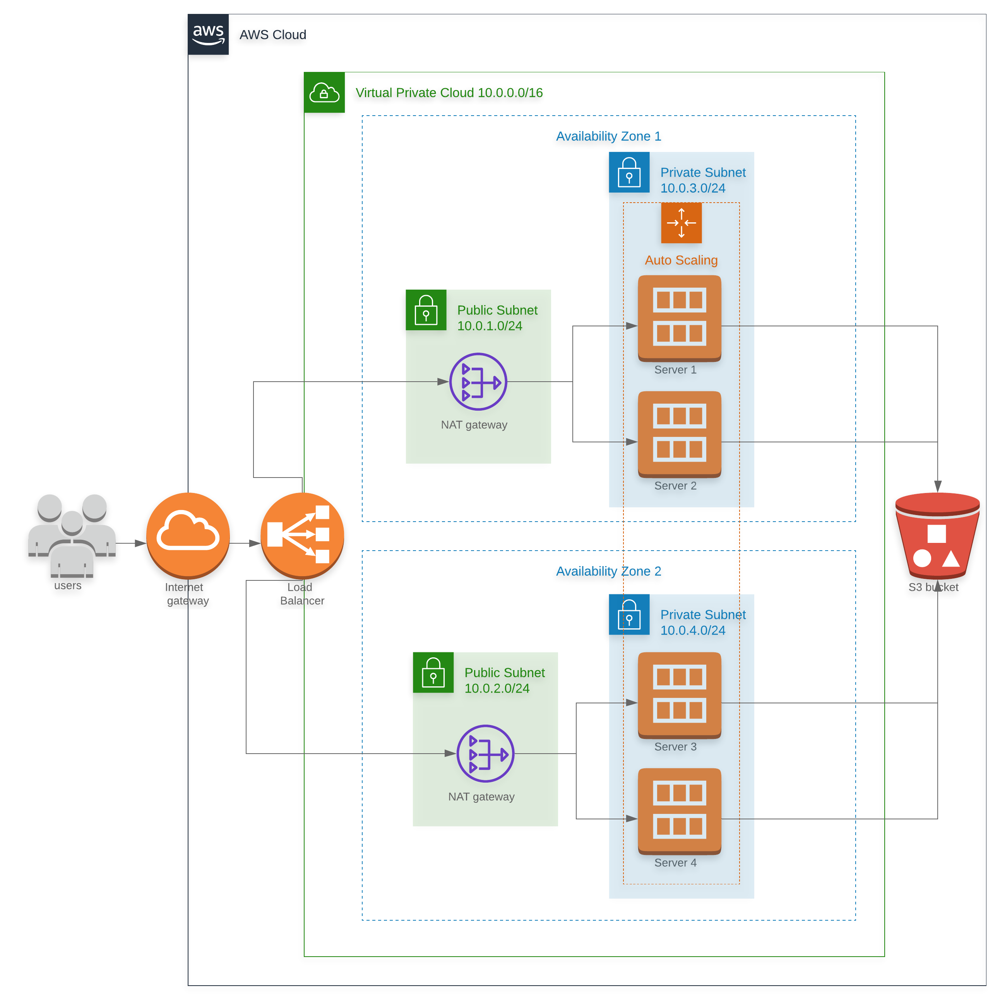

## Deploy a high-available web app using CloudFormation
The goal of this project is to automate the below diagram by using AWS CloudFormation:

### Pre-requisites
- Have an AWS account (non Educate because it lacks some advanced functionnalities)
### Steps
1. Create the [infrastructure template](./templates/infra.yml) along with its [parameters](./templates/parameters-infra.json).
2. Likewise create the [server template](./templates/server.yml) along with its [parameters](./templates/parameters-server.json).
3. To run the templates it is required to create an IAM role called `UdacityS3ReadOnlyEC2` from the AWS console.
4. To run the scripts:
```
./launchers/./create.sh ./templates/infra.yml ./templates/parameters-infra.json 
```
and
```
./launchers/./create.sh ./templates/server.yml ./templates/parameters-server.json
```
or directly 
```
./install.sh
```
This should spin up several services in your AWS account, and finally you should be able to display:

You can find the Udagram up and running here: http://Udagr-WebAp-142YYOIKSGI12-1630506093.us-west-2.elb.amazonaws.com