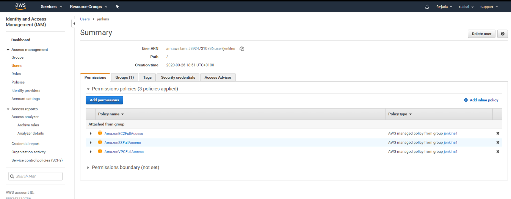
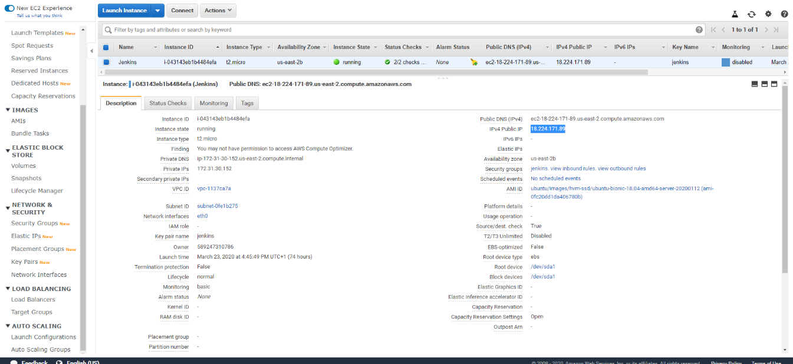
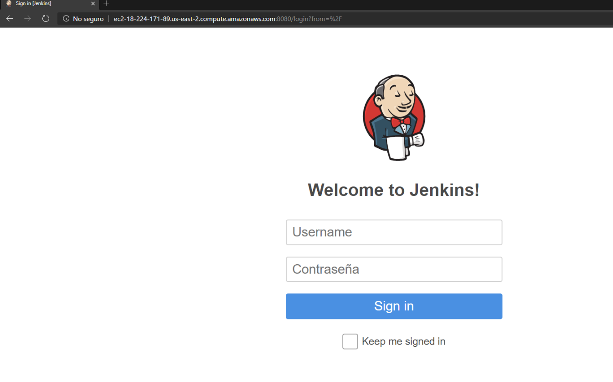
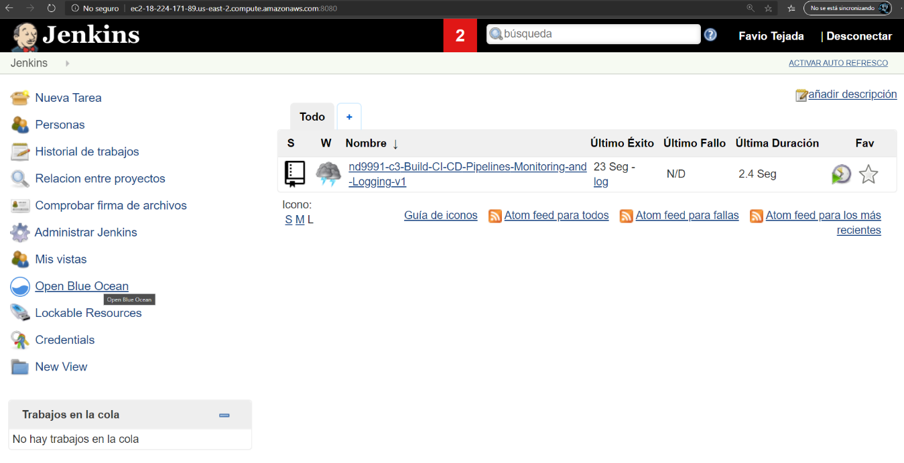
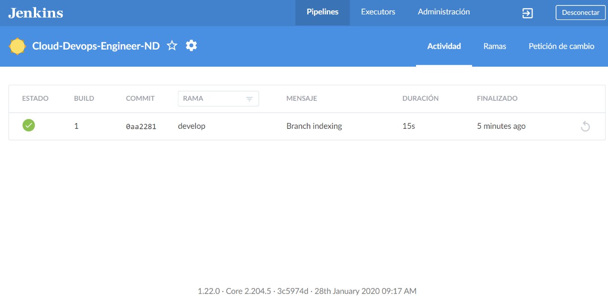
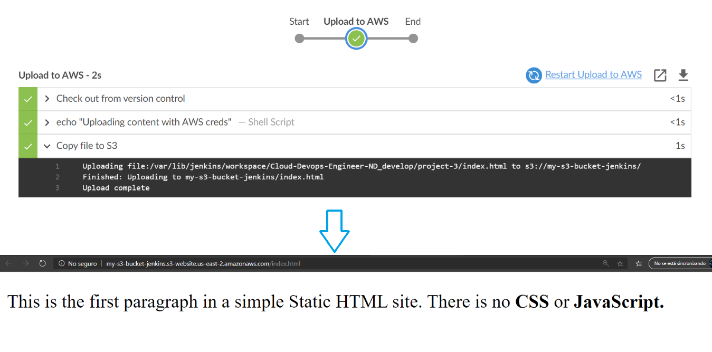
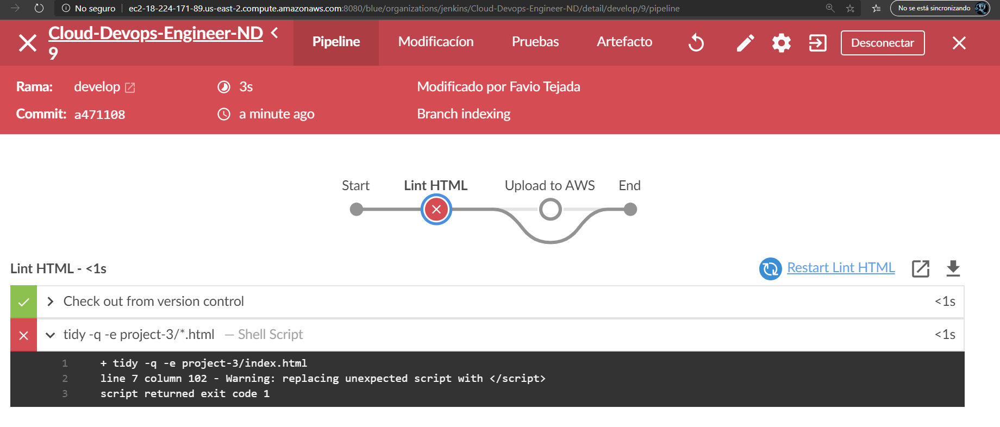
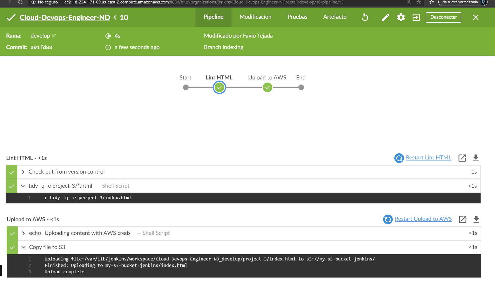

## Jenkins pipelines on AWS

### Requirements
* **Software requirements:** Jenkins, tidy linter
* **Cloud requirements:** AWS account (it can be Educate), IAM user, EC2 key-pair
* **Github repo**

The project's goal is to install Jenkins into a EC2 instance and define pipelines using _Blue Ocean_ plugin to simulate a CI/CD-static-website scenario being deployed into a S3 bucket.

### Steps
1. As a root AWS user create another policy/user called jenkins attaching the following policies:
* `AmazonEC2FullAccess`
* `AmazonVPCFullAccess`
* `AmazonS3FullAccess`</br>
The expected user should look like this:

The new user is now able to log in [here](https://589247310786.signin.aws.amazon.com/console)
2. With the new logged-in user, create an _EC2 instance_ with the following specs:
* Type: `t2.micro`
* Distribution: `Ubuntu 18.04 LTS amd64`</br>
Then generate a key-pair to connect via `ssh`
3. Configure its _inbound security policies_ with the following rules:
| Type | Protocol | Port Range | Source |
| ------ |  ------ |
| Custom TCP rule | TCP | 8080 | anywhere |
| SSH | TCP | 22 | _your IP_ |   
The AWS console instance configuration should look like this:

4. Once connected to the machine, install Jenkins and when reaching the FQDN the Jenkins login page is displayed:

My EC2 instance can be reached [here](http://ec2-18-224-171-89.us-east-2.compute.amazonaws.com:8080)
5. Once logged in the Jenkins GUI, install Blue Ocean plugin:

The link [here](http://ec2-18-224-171-89.us-east-2.compute.amazonaws.com:8080/blue/organizations/jenkins/pipelines)
6. Using the Blue Ocean GUI, create a new pipeline by hitting to the repo containing the config and sourcecode, the expected output should look like this:

The link [here](http://ec2-18-224-171-89.us-east-2.compute.amazonaws.com:8080/blue/organizations/jenkins/Cloud-Devops-Engineer-ND/detail/develop/1/pipeline)
7. Set up AWS credentials from Jenkins: credentials/global/add Credentials: Kind: AWS credentials -> add access and secret, in ID named it as aws-static
8. In AWS console, create a publicly accessible bucket.
9. Replace Jenkinsfile Build stage by with the following:
    ```Jenkins
    stage('Upload to AWS') {
        steps {
            withAWS(region:'us-east-2',credentials:'aws-static') {
            sh 'echo "Uploading content with AWS creds"'
                s3Upload(pathStyleAccessEnabled: true, payloadSigningEnabled: true, file:'index.html', bucket:'my-s3-bucket-jenkins')
            }
        }
    }
    ```
    Related commit [here](https://github.com/tejada7/Cloud-Devops-Engineer-ND/commit/d7fec3dcfb494caa3cc3d48cb550f32f037b2b50)</br>
    Jenkins will automatically run the job and if success then `index.html` will be deployed to the [S3 bucket](http://my-s3-bucket-jenkins.s3-website.us-east-2.amazonaws.com/index.html):
    
10. Since the deployed html has an error, it should be automatically detected in the build process (CI), in consequence we must define a Build job that verifies the correctness of the HTML code.
Related commit [here](https://github.com/tejada7/Cloud-Devops-Engineer-ND/commit/a47110892eba957f2272288db387698cdfc74d6b)</br>

Build [failure](http://ec2-18-224-171-89.us-east-2.compute.amazonaws.com:8080/blue/organizations/jenkins/Cloud-Devops-Engineer-ND/detail/develop/9/pipeline)
11. After fixing the code (related [commit](https://github.com/tejada7/Cloud-Devops-Engineer-ND/commit/a01fd88465be9e4a89c7e0fdeeb84c906d597d68)), we see the job now passes:

12. Finally, Jenkins has validated the code and deployed to our S3 bucket available [here](http://my-s3-bucket-jenkins.s3-website.us-east-2.amazonaws.com/index.html)